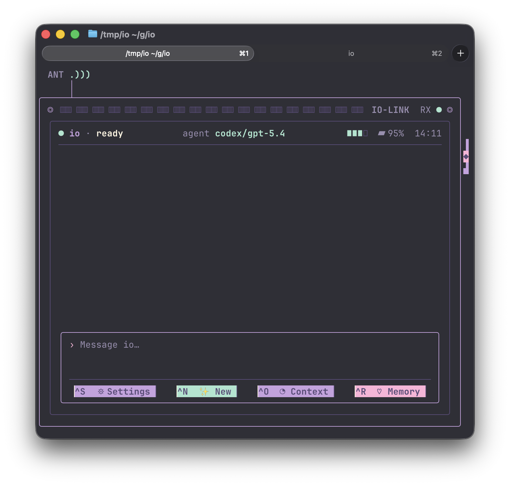

# io

`io` is a personal AI assistant TUI written in Go with Bubble Tea. It gives a
persistent assistant persona a dedicated terminal interface, stores its state
under `~/.io`, and drives an installed agent CLI instead of calling a model API
directly.

The current implementation supports Claude Code and Codex CLI harnesses, first
run persona setup, resumable sessions, local display history, model/effort
settings, context usage readouts, worker orchestration, automatic memory
consolidation, and a read-only memory view.



## Status

This repository contains the chat MVP, refreshed TUI, Phase 2 worker
orchestration/MCP plumbing, and Phase 3 compaction/dreamer behavior. Claude is
run as a live streaming persona and receives io's temporary MCP worker tools.
Codex is run as resumable `codex exec --json` turns; Codex MCP wiring remains
disabled until verified.

## Requirements

- One or both supported agent CLIs installed and authenticated:
  - `claude` for the Claude harness
  - `codex` for the Codex harness
- Go matching `go.mod` (`go 1.25.2`) when building from source

## Installation

Published releases are installable from the Homebrew tap:

```sh
brew install paradise-runner/tap/io
```

Release binaries are attached to GitHub releases:

```sh
# example for Apple Silicon macOS
curl -Lo io.zip https://github.com/paradise-runner/io/releases/latest/download/io-darwin-arm64.zip
unzip io.zip
install -m755 io-darwin-arm64 /usr/local/bin/io
```

## Run

Start the installed TUI:

```sh
io
```

Or run from the repository root:

```sh
go run ./cmd/io
```

On first run, `io` asks which harness to use and which personality preset to
write into `~/.io/SOUL.md`. After setup, it starts the selected harness and
resumes the saved session on later launches.

For an offline UI-only demo that does not require Claude or Codex:

```sh
go run ./cmd/iodemo
```

The demo uses generic canned tasks and local-only state so the UI can be shown,
tested, and screenshotted without exposing a real workspace or agent session.

## CLI Options

```sh
go run ./cmd/io --harness codex --model gpt-5.4 --effort medium
```

| Flag | Description |
| --- | --- |
| `-harness`, `-agent-harness` | Agent harness: `claude` or `codex`. |
| `-model`, `-agent-model` | Model override for the selected harness. |
| `-effort`, `-agent-effort` | Reasoning effort: `low`, `medium`, or `high`. |
| `-claude-path` | Path to a specific `claude` binary. |
| `-codex-path` | Path to a specific `codex` binary. |
| `-version` | Print the build version and exit. |

Defaults are defined in `internal/agentharness`: Claude is the default harness,
Claude defaults to `sonnet`, Codex defaults to `gpt-5.4`, and reasoning effort
defaults to `medium`.

## Controls

Main chat:

- `Enter`: send the current message
- `Ctrl+C`: quit
- `Up` / `Down`: recall sent messages when the input is single-line
- `PageUp` / `PageDown` or `Ctrl+U` / `Ctrl+D`: scroll chat history
- Mouse wheel: scroll chat history

Toolbar screens:

- `Ctrl+S`: Settings
- `Ctrl+N`: New chat
- `Ctrl+O`: Context usage
- `Ctrl+R`: Memory

Settings:

- `Up` / `Down` / `Tab`: move between fields
- `Left` / `Right`: change the selected field
- `Enter`: save
- `Esc`: return to chat

Context:

- `c`: request compaction now
- `Esc`, `Enter`, or `q`: return to chat

## Persistence

`io` stores its own state under `~/.io`:

| Path | Purpose |
| --- | --- |
| `~/.io/SOUL.md` | Generated and editable assistant personality prompt. |
| `~/.io/state.json` | Selected harness, models, effort, thresholds, session IDs, and dream bookkeeping. |
| `~/.io/history.jsonl` | Display transcript used to restore the TUI chat history. |
| `~/.io/memory/` | Harness-backed assistant memory directory. |

Claude sessions are run as a persistent streaming process. Codex turns are run
through `codex exec --json` and resume the stored thread ID when available.
Claude sessions receive a temporary MCP config for io's worker tools. Workers
run as bounded one-shot harness prompts, report status in the TUI, and inject
their result back into the active conversation when finished.

When the harness reports context usage above the configured threshold, io asks
live harnesses to compact. After enough completed chats and while the app is
idle, the dreamer summarizes durable facts into `~/.io/memory/MEMORY.md`.

## Development

Run the normal test suite:

```sh
go test ./...
```

Regenerate the checked-in screenshot used by the README and landing page:

```sh
go run ./cmd/ioscreenshot io-example.png
```

The screenshot generator drives `cmd/iodemo` in deterministic screenshot mode.
It requires macOS with Ghostty, tmux, clang, and `screencapture`. Ghostty must
be allowed in System Settings > Privacy & Security > Screen & System Audio
Recording.

Install the `prek` pre-push hook that regenerates `io-example.png` before each
push and stops the push when the committed PNG is stale:

```sh
prek install --hook-type pre-push
```

Run the real-Claude smoke test when `claude` is installed and authenticated:

```sh
go test -tags=integration ./internal/persona
```

Most harness-facing tests use fake Claude and Codex binaries from
`internal/persona/testdata/`, so the default suite is fast and offline.

## Releases

Push a `v*` tag to publish release binaries:

```sh
git tag v0.1.0
git push origin v0.1.0
```

The release workflow builds macOS and Linux binaries for `amd64` and `arm64`,
uploads zipped assets plus `checksums.txt`, and updates
`paradise-runner/homebrew-tap/io.rb`. The workflow needs a
`HOMEBREW_TAP_TOKEN` repository secret with write access to the tap.

## Project Layout

| Path | Description |
| --- | --- |
| `cmd/io` | Main `io` application entrypoint and TUI controller adapter. |
| `cmd/iodemo` | Offline canned-data TUI demo. |
| `cmd/ioscreenshot` | Ghostty/tmux screenshot generator for `io-example.png`. |
| `internal/agentharness` | Harness choices, model defaults, and normalization. |
| `internal/claudeproc` | Parser and input encoder for Claude stream-json. |
| `internal/codexproc` | Parser for Codex JSONL output. |
| `internal/ioipc` | Local Unix-socket control protocol for worker operations. |
| `internal/iomcp` | MCP stdio helper exposing io worker tools. |
| `internal/persona` | Process controller for the selected harness. |
| `internal/personastate` | `~/.io` paths and persisted state. |
| `internal/soul` | First-run persona presets and `SOUL.md` rendering. |
| `internal/tui` | Bubble Tea model, chat UI, controls, dialogs, and styling. |
| `internal/workers` | Worker manager, lifecycle status, and harness runners. |
| `docs/superpowers` | Design specs and implementation plans. |
| `index.html` | Static visual prototype/mockup. |
